# EjerciciosPracticosUnidad2.2
<!--  Rey Gerardo Avalos Mellado -->

  

<h1 align="center" style="color:#00FF00;">
  1224100509
</h1>

---

## 💀 Datos del Proyecto

| 🔧 Elemento | 💣  |
|-------------|----------------|
| **Materia:** | Estructura de Datos |
| **Autor:** | **Rey Gerardo Avalos Mellado** |
| **Proyecto:** | Implementación de estructuras enlazadas en Java  |
| **Entorno:** | NetBeans / Java |

---

## 🩸 Actividad 01 – Manipulación de Lista Enlazada

🎯 **Objetivo:**  
Desarrollar un programa que implemente operaciones básicas sobre una lista enlazada
simple de números enteros positivos.

| Módulo | Archivo |
|--------|----------|
| Implementación | [ejer1.java](ejer1.java) |

⚙️ **Modo de Operación:**

1-Genera números enteros positivos al azar.

2-Inserta cada número al final de una lista enlazada simple.

3-Recorre la lista mostrando cada elemento.

4-Pide un valor límite al usuario.

5-Elimina los nodos con valores mayores al límite dado.

---

## 🕶 Actividad 02 – Lista Enlazada de Palabras desde Archivo

🎯 **Objetivo:**  
Desarrollar un programa que lea palabras desde un archivo de texto y las almacene en una
lista enlazada, permitiendo su manipulación dinámica.  

| Módulo | Archivo |
|--------|----------|
| Implementación | [ejer2.java](ejer2.java) |

⚙️ **Modo de Operación:**

1-Lee palabras desde un archivo de texto.

2-Crea una lista enlazada simple con las palabras en orden de aparición.

3-Permite agregar nuevas palabras a la lista.

4-Permite eliminar palabras específicas.

5-Al final, escribe nuevamente todas las palabras en el archivo.

---

## 🔥 Actividad 03 – Representación y Evaluación de Polinomios con Listas Enlazadas

🎯 **Objetivo:**  
Desarrollar un programa que permita representar polinomios mediante una lista enlazada
simple y calcular sus valores para distintos puntos de evaluación.

| Módulo | Archivo |
|--------|----------|
| Implementación | [ejer3.java](ejer3.java) |

⚙️ **Modo de Operación:**

1-Solicita al usuario los términos del polinomio (coeficiente y exponente).

2-Crea una lista enlazada simple con los términos en orden de entrada.

3-Evalúa el polinomio para valores de x desde 0.0 hasta 5.0 (cada 0.5).

4-Muestra una tabla con los resultados de P(x).

---

## 🌀 Actividad 04 – Polinomio con Lista Enlazada Circular

🎯 **Objetivo:**  
Modificar la representación de un polinomio mediante lista enlazada simple para que se
convierta en una lista circular, optimizando el acceso y recorrido continuo.

| Módulo | Archivo |
|--------|----------|
| Implementación | [ejer4.java](ejer4.java) |

⚙️ **Modo de Operación:**

1-Parte del modelo del polinomio anterior.

2-Convierte la lista simple en una lista circular (el último nodo apunta al primero).

3-Usa como referencia el último nodo para acceder al primero.

4-Solicita coeficientes y exponentes del polinomio.

5-Recorre la lista desde el primer nodo hasta volver al inicio.

---

## 🕸 Actividad 05 – Lista Doblemente Enlazada de Caracteres

🎯 **Objetivo:**  
Desarrollar un programa que construya una lista doblemente enlazada a partir de los
caracteres de una cadena ingresada por el usuario, y que luego ordene dicha lista
alfabéticamente para mostrarla en pantalla.

| Módulo | Archivo |
|--------|----------|
| Implementación | [ejer5.java](ejer5.java) |

⚙️ **Modo de Operación:**

1-Solicita una cadena de texto al usuario.

2-Crea una lista doblemente enlazada, con un nodo por cada carácter.

3-Cada nodo tiene enlace al anterior y al siguiente.

4-Ordena alfabéticamente los caracteres en la lista.

5-Muestra los caracteres ordenados en pantalla.

## 🧱 Pilas

### 🧩 Ejercicio 1 – Simulación simple de pilas

🎯 **Objetivo:**  
Practicar las operaciones básicas `push` y `pop` en una pila.

⚙️ **Pseudocódigo / Algoritmo:**
1. Crear una pila vacía  
2. Insertar 5, 10, 15, 20  
3. Eliminar dos elementos  
4. Mostrar contenido actual de la pila  

| Módulo | Archivo |
|--------|----------|
| Implementación | [ejer1_simulacionSimpleDePilas.java](ejer1_simulacionSimpleDePilas.java) |

🖼 **Imagen:**  
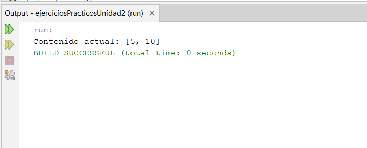

---

### 🧩 Ejercicio 2 – Pila de nombres

🎯 **Objetivo:**  
Implementar una pila de nombres que permita apilarlos y mostrarlos en orden inverso.

⚙️ **Pseudocódigo / Algoritmo:**
1. Crear una pila vacía  
2. Leer nombres del usuario hasta que escriba “FIN”  
3. Insertar cada nombre en la pila  
4. Mostrar los nombres en orden inverso  

| Módulo | Archivo |
|--------|----------|
| Implementación | [ejer2_PilaDeNombres.java](ejer2_PilaDeNombres.java) |

🖼 **Imagen:**  
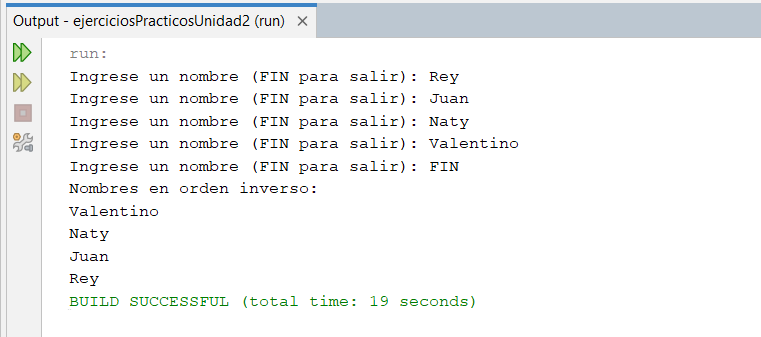

---

### 🧩 Ejercicio 3 – Verificar si una pila está vacía

🎯 **Objetivo:**  
Comprobar si una pila se encuentra vacía antes y después de insertar elementos.

⚙️ **Pseudocódigo / Algoritmo:**
1. Crear una pila vacía  
2. Verificar si está vacía  
3. Insertar un elemento  
4. Verificar nuevamente  

| Módulo | Archivo |
|--------|----------|
| Implementación | [ejer3_VerificarSiUnaPilaEstaVacia.java](ejer3_VerificarSiUnaPilaEstaVacia.java) |

🖼 **Imagen:**  
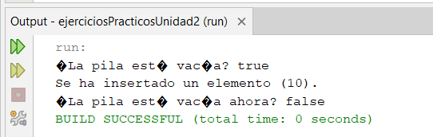

---

### 🧩 Ejercicio 4 – Invertir una palabra

🎯 **Objetivo:**  
Usar una pila para invertir una palabra ingresada por el usuario.

⚙️ **Pseudocódigo / Algoritmo:**
1. Leer palabra del usuario  
2. Apilar cada carácter  
3. Desapilar y mostrar los caracteres  

| Módulo | Archivo |
|--------|----------|
| Implementación | [ejer4_invertirUnaPalabra.java](ejer4_invertirUnaPalabra.java) |

🖼 **Imagen:**  
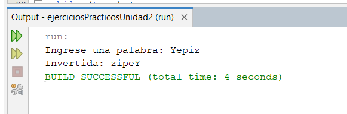

---

### 🧩 Ejercicio 5 – Balanceo de paréntesis

🎯 **Objetivo:**  
Comprobar si una expresión matemática tiene paréntesis balanceados.

⚙️ **Pseudocódigo / Algoritmo:**
1. Leer expresión  
2. Recorrer cada carácter  
3. Apilar si es ‘(’  
4. Desapilar si es ‘)’  
5. Validar que la pila quede vacía  

| Módulo | Archivo |
|--------|----------|
| Implementación | [ejer5_BalanceoDeParentesis.java](ejer5_BalanceoDeParentesis.java) |

🖼 **Imagen:**  
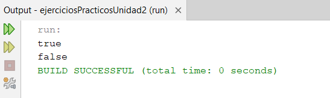

---

### 🧩 Ejercicio 6 – Decimal a binario

🎯 **Objetivo:**  
Convertir un número decimal a binario usando una pila.

⚙️ **Pseudocódigo / Algoritmo:**
1. Leer número decimal  
2. Dividir entre 2 y apilar los residuos  
3. Desapilar y mostrar el resultado binario  

| Módulo | Archivo |
|--------|----------|
| Implementación | [ejer6_DecimalABinario.java](ejer6_DecimalABinario.java) |

🖼 **Imagen:**  
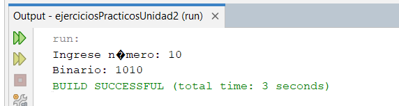

---

### 🧩 Ejercicio 7 – Simular función deshacer (UNDO)

🎯 **Objetivo:**  
Simular una función “deshacer” mediante una pila.

⚙️ **Pseudocódigo / Algoritmo:**
1. Crear pila vacía  
2. Registrar acciones del usuario  
3. Si se ingresa “UNDO”, eliminar la última acción  
4. Mostrar estado actual  

| Módulo | Archivo |
|--------|----------|
| Implementación | [ejer7_SimularFuncionDeshacer.java](ejer7_SimularFuncionDeshacer.java) |

🖼 **Imagen:**  
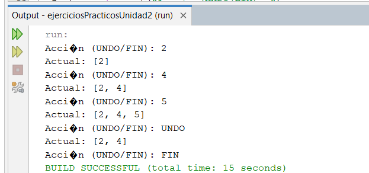

---

### 🧩 Ejercicio 8 – Evaluar expresión postfija

🎯 **Objetivo:**  
Evaluar una expresión en notación postfija usando pilas.

⚙️ **Pseudocódigo / Algoritmo:**
1. Leer expresión postfija  
2. Recorrer tokens  
3. Apilar operandos  
4. Al encontrar un operador, desapilar dos valores y operar  
5. Mostrar el resultado  

| Módulo | Archivo |
|--------|----------|
| Implementación | [ejer8_evaluarExpresionPostfija.java](ejer8_evaluarExpresionPostfija.java) |

🖼 **Imagen:**  
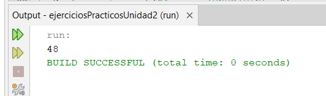

---

### 🧩 Ejercicio 9 – Revertir lista

🎯 **Objetivo:**  
Usar una pila para invertir los elementos de una lista de enteros.

⚙️ **Pseudocódigo / Algoritmo:**
1. Crear lista con elementos  
2. Apilar todos los elementos  
3. Desapilar y mostrar en orden inverso  

| Módulo | Archivo |
|--------|----------|
| Implementación | [ejer9_RevertirLista.java](ejer9_RevertirLista.java) |

🖼 **Imagen:**  
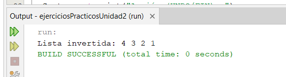

---

### 🧩 Ejercicio 10 – Verificar palíndromo

🎯 **Objetivo:**  
Determinar si una palabra es palíndroma utilizando una pila.

⚙️ **Pseudocódigo / Algoritmo:**
1. Leer palabra del usuario  
2. Apilar cada carácter  
3. Desapilar para invertirla  
4. Comparar con la palabra original  

| Módulo | Archivo |
|--------|----------|
| Implementación | [ejer10_VerificarPalindromo.java](ejer10_VerificarPalindromo.java) |

🖼 **Imagen:**  
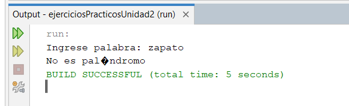

---

## 🧱 Colas

### 🧩 Ejercicio 1 – Comparación de Colas

🎯 **Objetivo:**  
- Aplicar estructuras de datos tipo cola.  
- Implementar recorrido y comparación de elementos.  
- Preservar el estado original de las colas (opcional con colas auxiliares).  

📘 **Descripción:**  
Escribir un método que reciba como argumentos dos colas del mismo tipo y devuelva `true` si ambas colas son idénticas (mismo tamaño y mismos elementos en el mismo orden), o `false` en caso contrario.  

| Módulo | Archivo |
|--------|----------|
| Implementación | [ejer1_ComparacionDeColas.java](ejer1_ComparacionDeColas.java) |

🖼 **Imagen:**  
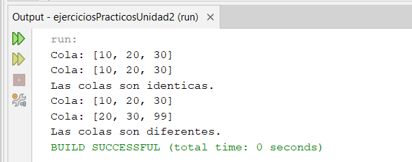

---

### 🧩 Ejercicio 2 – Simulación de Supermercado con Carritos y Cajas

🎯 **Objetivo:**  
- Modelar colas para carritos y cajas.  
- Aplicar lógica de asignación y liberación de recursos.  
- Simular comportamiento de clientes en tiempo discreto.  

📘 **Descripción:**  
Simular el funcionamiento de un supermercado con:  
- 25 carritos de compra.  
- 3 cajas de pago.  
- Clientes que esperan si no hay carritos disponibles.  
- Los clientes se colocan en la cola de la caja con menos personas y liberan el carrito al pagar.  

| Módulo | Archivo |
|--------|----------|
| Implementación | [ejer2_SimulacionSupermercado.java](ejer2_SimulacionSupermercado.java) |

🖼 **Imagen:**  
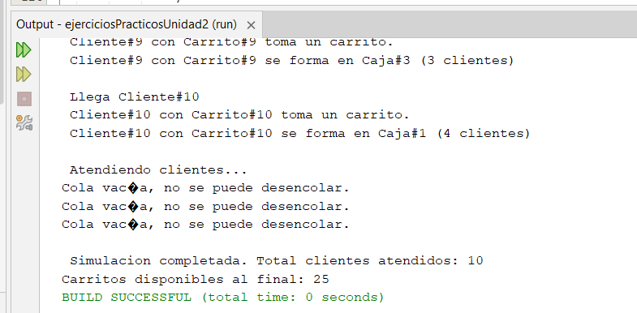

---

### 🧩 Ejercicio 3 – Simulación de Atención al Cliente en Supermercado

🎯 **Objetivo:**  
- Aplicar estructuras de cola y simulación temporal.  
- Implementar lógica condicional y aleatoria.  
- Generar estadísticas de rendimiento.  

📘 **Descripción:**  
Simular el flujo de atención durante **7 horas**, considerando:  
- Una fila única de clientes.  
- 3 cajas activas (abrir una cuarta si hay más de 20 clientes).  
- Tiempos de atención distribuidos uniformemente por caja.  
- Llegadas de clientes cada minuto (en promedio).  
- Estadísticas calculadas:  
  - Total de clientes atendidos.  
  - Tamaño medio y máximo de la fila.  
  - Tiempo máximo de espera.  
  - Minuto de apertura de la cuarta caja.  

| Módulo | Archivo |
|--------|----------|
| Implementación | [ejer3_AtencionClientes.java](ejer3_AtencionClientes.java) |

🖼 **Imagen:**  
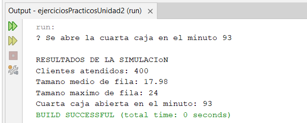

---

## 🕶 Autor 

**Rey Gerardo Avalos Mellado**  

**1224100509**

**GTID0141**
💻 
